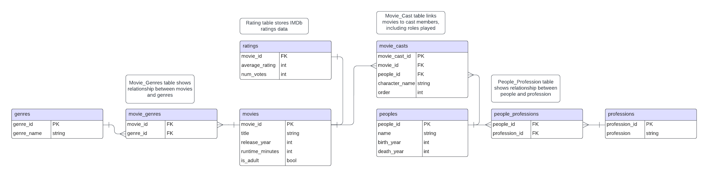

# imdb-moviedb

This project is about data modeling and database design focused on creating a data warehouse for storing and analyzing movie-related data based on the IMDb dataset. The main objective is to practice designing a data model that supports efficient querying and analysis.

## Entity Relationship Diagram (ERD)

